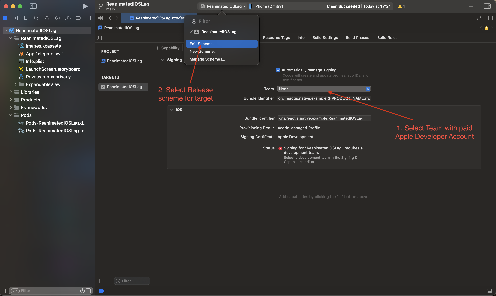

# Reproduction guide

## Step 1: Install dependencies


```sh
# Using Yarn and CocoaPods
yarn; 
cd ios;
bundle install; 
bundle exec pod install;
```

## Step 2: Set up Xcode environment

1. Select team with paid Apple Developer account
2. Change scheme from debug to release at the app target



## Step 3: Set up iPhone and run

Connect iPhone (with ProMotion, like iPhone 15 Pro) by a wire, with developer mode enabled to your Mac and give all necessary permissions

Run the application 
```sh
yarn ios;
```

## Step 4: See the modal example

You will see two buttons: `"Show/Hide"` and `"Variation"`, so there are 3 variations:

1. native - custom Fabric animated `UIView`: see `ExpandableView` in the `ios` directory and `specs/ExpandableViewNativeComponent`
2. reanimated - Reanimated View animated by `useSharedValue` and `withTiming`: explore `App.tsx` for code example
3. animated - react-native Animated View animated by Animated API: explore `App.tsx` for code example

By pressing the `"Variation"` button you change what type of animated modal will show and hide
By pressing the `"Show/Hide"` button you activate animations (all logic is in `App.tsx`)

You will see how native is significantly better and runs at 120 FPS while Reanimated and React Native Animated run at lower than 60 FPS

## Additional info

Also you can see example.MP4 at root how to use the example


